# Halyk AI Challenge 2026 — полный разбор условий, датасета и стратегия победы

> Дата анализа: 6 августа 2026 года, часовой пояс Asia/Qyzylorda.  
> Рабочая папка: `C:\Users\Nurkhan\Desktop\halyk-hackathon`.  
> Этот документ — анализ и план разработки. Это не финальный ответ на приватный датасет: по правилам конкурса ответы должен сгенерировать собственный агент команды.

## 0. Главный вывод

Это не задача «задать хороший вопрос LLM» и не обычный RAG. Это задача построения проверяемого финансового decision engine поверх грязного архива:

1. определить, какие документы относятся к нужному заёмщику;
2. выбрать действующую редакцию и отбросить устаревшие договоры и черновики;
3. прочитать текстовые и сканированные страницы;
4. восстановить категории транзакций, которых нет в леджере;
5. применить принятые аудитором переклассификации, но не применять отклонённые и промежуточные;
6. учесть валюту, период, начисления, отсутствующие суммы, KYC и структуру владения;
7. детерминированно вычислить показатель ковенанта;
8. определить статус по неокруглённому значению;
9. контрфактически найти единственную определяющую транзакцию либо вернуть `null`;
10. сформировать строго валидный `submission.json`.

Наиболее сильное решение — гибрид: мультимодальная модель извлекает структурированные факты, а все вычисления, сравнения, приоритеты документов, поиск evidence и валидацию JSON выполняет обычный код. Нельзя отдавать арифметику и окончательный вердикт одному свободному LLM-промпту.

Критическое организационное действие: немедленно уточнить даты у организаторов. На скриншотах есть противоречия: дедлайн регистрации указан и 5, и 6 августа; «день хакатона» указан 7 августа, а приватный датасет и приём решения — 9 августа; публикация результатов тоже указана 9 августа.

## 1. Полная расшифровка семи скриншотов

Ниже сведён весь смысловой текст, видимый на предоставленных изображениях. Переносы строк нормализованы, но формулировки, даты, суммы и названия сохранены.

### Скриншот 1 — обложка

Навигация:

> Главная / Другие услуги / Halyk AI Challenge

Заголовок:

> Halyk AI Challenge

Подзаголовок:

> Создайте AI-агента, который действует как эксперт банка

Ниже начинается раздел «Задача».

### Скриншот 2 — задача

#### Задача

##### Научите AI принимать решения

Настоящие бизнес-задачи редко решаются одним запросом к модели. Здесь агенту предстоит читать десятки документов, находить нужные версии, сопоставлять данные, проверять ограничения и доказывать свои выводы.

##### Задачи агента

- Разобраться в десятках документов;
- Отличить актуальные данные от устаревших;
- Извлечь скрытые факты;
- Связать их с транзакциями;
- Принять решение;
- Объяснить, почему оно верное.

### Скриншот 3 — детали

#### Детали

##### Призовой фонд

- 1-е место — 1 000 000 ₸
- 2-е место — 700 000 ₸
- 3-е место — 500 000 ₸

##### Рабочий процесс агента

- Получает архив с документами и реестром;
- Находит релевантные документы;
- Извлекает необходимые факты;
- Строит связи между документами и транзакциями;
- Рассчитывает показатели;
- Формирует обоснованный ответ с доказательствами.

##### Критерии оценки

Оценивается не только правильность ответа, но и качество логики агента:

- Корректность решения;
- Точность вычислений;
- Подтверждение доказательствами.

##### Что получает участник

- Синтетический банковский датасет;
- PDF-документы различных типов;
- Реестр транзакций;
- Шаблон ответа;
- Описание правил оценки.

##### Что необходимо сдать

1. `Submission.json`;
2. GitHub-репозиторий с кодом агента;
3. README по запуску проекта.

### Скриншот 4 — общая информация и участники

#### Общие правила участия в Halyk AI Challenge

##### 1. Общая информация

**Формат проведения:** онлайн. Все этапы, включая регистрацию и сдачу решений, проходят на сайте.

**Ключевые даты:**

- Дедлайн регистрации: «6» августа 2026 г.
- День хакатона: «7» августа 2026 г.
- Публикация результатов: «9» августа 2026 г.

##### 2. Требования к участникам и командам

**Кто может участвовать:** любой резидент Республики Казахстан старше 18 лет.

**Состав команды:** индивидуально или командой от 2 до 4 человек.

**Требуемый опыт:** опыт работы с LLM и агентными пайплайнами желателен, но не обязателен.

### Скриншот 5 — регистрация и этапы

##### 3. Регистрация

**Указываем:** имя и фамилия, email (с подтверждением), университет/компания и должность, название команды (одинаковое у всех участников команды).

После регистрации вы получите ссылку на Telegram-чат участников.

##### 4. Этапы хакатона

**1. Регистрация (31 июля — 5 августа)**  
Заполните регистрационную форму, указав имя и фамилию, email (с подтверждением), университет/компанию, должность и название команды (для всех участников команды оно должно быть одинаковым). После регистрации вы получите ссылку на Telegram-чат участников.

**2. Публикация открытого датасета (6–8 августа)**  
В один из дней с 6 по 8 августа будет опубликован открытый датасет сроком на три дня. Используйте его для подготовки: изучите структуру данных, протестируйте пайплайн и отработайте подход к решению.

**3. Публикация приватного датасета (9 августа, 11:00)**  
В 11:00 (по времени Астаны) станет доступен приватный датасет с боевым заданием. На его основе необходимо подготовить финальное решение.

**4. Завершение приёма работ (9 августа, 14:00)**  
До 14:00 (по времени Астаны) необходимо загрузить готовое решение в установленном формате. После указанного времени приём работ закрывается, поздние отправки не принимаются.

### Скриншот 6 — формат ответа и оценка

##### 5. Формат и подача решения

**Формат файла:** решение подаётся в виде JSON-файла по предоставленному шаблону.

**Структура ответа:** по каждому ковенанту каждого заёмщика ответ должен содержать 3 компонента:

- Вердикт — ковенант соблюдён или нарушен;
- Число, обосновывающее вердикт;
- Транзакция-улика — если нарушение связано с конкретной транзакцией.

##### 6. Оценка работ и определение победителей

**Формат заданий:** вопросы с точным ответом. Каждый ковенант оценивается независимо, по трём компонентам ответа — возможен частичный зачёт. Итог — сумма баллов по всем ковенантам, один общий рейтинг.

**Система баллов:** баллы начисляются за каждый правильный ответ.

При равенстве баллов побеждает команда, чья лучшая попытка была загружена раньше.

**Призы:**

- 1 место — 1 000 000 ₸
- 2 место — 700 000 ₸
- 3 место — 500 000 ₸

### Скриншот 7 — ограничения

##### 7. Важные ограничения

**Как должны получаться ответы:** запрещено получать ответы вручную — в том числе через готовые агенты вроде Claude Code или Codex. Такими инструментами можно пользоваться только для разработки вашего решения; все ответы должен сгенерировать ваш собственный агент.

**Инструменты:** разрешены любые модели (OpenAI, Anthropic, Mistral и т. д.), любые OCR- и vision-движки, любые библиотеки как основа вашего пайплайна.

**Нарушение правил приведёт к дисквалификации команды.**

## 2. Сводка правил и найденные противоречия

Детальная русская постановка уже находится в `agentic-bank-public/CASE.ru.md`; казахская версия — в `agentic-bank-public/CASE.kz.md`.

| Вопрос | Подтверждённое правило | Риск/несогласованность |
|---|---|---|
| Формат | Онлайн | Нет |
| Команда | 1 человек либо 2–4 человека | Нет |
| Возраст/резидентство | Резидент РК, старше 18 лет | Нет |
| Регистрация | Скриншот 4: до 6 августа; скриншот 5: 31 июля–5 августа | Нужно немедленное подтверждение у организаторов |
| День хакатона | Скриншот 4: 7 августа | Не совпадает с приватным датасетом 9 августа |
| Приватный датасет | 9 августа, 11:00, время Астаны | Выглядит как фактическое начало боевого окна |
| Дедлайн | 9 августа, 14:00, время Астаны | Трёхчасовое окно |
| Результаты | Скриншот 4: 9 августа | Совпадают по дате с боевым окном; требуется подтверждение |
| Сдача | JSON, GitHub-код, README | Детальная постановка уточняет точную JSON-схему |
| Ответы | Только собственный агент | Люди и готовые coding agents не должны вручную решать приватные ячейки |
| Тай-брейк | Раньше загруженная лучшая попытка | Нельзя откладывать первую полностью валидную отправку |

До начала разработки нужно получить в Telegram/на странице однозначный ответ на три вопроса: точный дедлайн регистрации, точная дата приватного набора и разрешено ли несколько попыток.

## 3. Что реально лежит в датасете

### 3.1. Инвентаризация

| Артефакт | Фактическое содержимое |
|---|---|
| `CASE.ru.md`, `CASE.kz.md` | Полная постановка на русском и казахском |
| `submission_template.json` | 12 сценариев × 3 ковенанта = 36 готовых ячеек |
| `ground_truth.json` | Публичный эталон v1, seed 42, ответы на все 36 ячеек |
| `master_ledger_2025.csv` | 1 473 транзакции, 561 счёт, период 2025-01-01–2025-12-31, USD и EUR |
| Целевые строки леджера | 673 строки: 658 USD и 15 EUR |
| Отвлекающие строки леджера | 800 строк по нецелевым scenario/account |
| `documents/*.pdf` | 200 PDF, суммарно 843 страницы |
| Непосредственно связанные с 12 целями PDF | Не менее 67: 66 определяются по `account_id` в тексте и 1 целевой KYC является полным сканом |
| `documents/4a5315740e89.csv` | 60 строк технических логов с повреждённой/лишней схемой; отвлекающий файл |
| `documents/904dea48b34b.txt` | Прямое предупреждение, что архив смешивает периоды, типы и устаревшие редакции |
| `Thumbs.db` | Системный мусор |

В леджере ровно две строки без суммы, обе целевые:

- `TXN-P7-0033` — фактическая сумма `$486,204.19` раскрыта в записке казначейства;
- `TXN-P8-0031` — фактическая сумма `$884,204.16` раскрыта в окончательных аудиторских примечаниях.

### 3.2. Качество PDF и обязательный OCR

Медианный текстовый слой PDF — около 2 176 символов, но проверка всего файла недостаточна. Найдено 7 страниц с текстовым слоем короче 80 символов в 4 документах:

- `f3fa6d20c8a1.pdf`, страницы 1–3 — полностью сканированный KYC P6;
- `63e162bd710b.pdf`, страница 2 — сканированная таблица KYC P2;
- `aaf665cbc612.pdf`, страница 2 — сканированная таблица обеспечительного покрытия P9;
- `2ed0b2ee4b57.pdf`, страницы 3–4 — заголовок и сканированная таблица корректировок EBITDA P4.

Это доказывает, что OCR/vision fallback нужен **на уровне страницы**, даже если весь PDF в целом хорошо извлекается библиотекой.

### 3.3. Связь scenario, account и документов

`scenario_id` извлекается из `txn_id`: например, `TXN-P1-0030` относится к P1. Затем `account_id` этой строки связывает сценарий с документами.

| Scenario | Account | Заёмщик | Действующий договор | Аудиторские примечания | KYC/структура |
|---|---|---|---|---|---|
| P1 | ACC-7801 | Aktau Port Services JSC | `8d878af064f2.pdf` | `896b7933db48.pdf` | `2dd8671ac405.pdf` |
| P2 | ACC-7802 | Almaty Cold Chain JSC | `b2519c8e3ea4.pdf` | `3fd0d34546b5.pdf` | `63e162bd710b.pdf`, стр. 2 — scan |
| P3 | ACC-7803 | Shymkent Refinery Services JSC | `85afaaca89ad.pdf` | `6f1c06f8479a.pdf` | `ee32532e1126.pdf` |
| P4 | ACC-7804 | Aktobe Grain Terminal JSC | `3a4aa2dbd6c4.pdf` | `2ed0b2ee4b57.pdf`, стр. 4 — scan | `9f1a89a5ed42.pdf` |
| P5 | ACC-7805 | Ekibastuz Power Services JSC | `1d262694c308.pdf` | `ea8d8bac3e62.pdf` | `89af6ae7964f.pdf` |
| P6 | ACC-7806 | Taraz Cement Works JSC | `be7c1bba8940.pdf` | `3963dfb04b2a.pdf` | `f3fa6d20c8a1.pdf`, весь документ — scan |
| P7 | ACC-7807 | Atyrau Pipeline Services JSC | `6acb5bbc3e70.pdf` | `596a5d8b04f5.pdf` | `2bdb134db53c.pdf`; казначейство `26acfab1e58b.pdf` |
| P8 | ACC-7808 | Kyzylorda Drilling Services JSC | `61dfc54675dc.pdf` | `bf9b7bffc514.pdf` | `22c1707dad45.pdf` |
| P9 | ACC-7809 | Zhezkazgan Mining Services JSC | `c2c9382c9168.pdf` | `7903e7d18e94.pdf` | `aaf665cbc612.pdf`, стр. 2 — scan |
| P10 | ACC-7810 | Karaganda Logistics Terminal JSC | `ba475cfc33a4.pdf` | `4db1d630055f.pdf` | `07e1a2a0275d.pdf` |
| B1 | ACC-7201 | Ekibastuz Energy JSC | `b38facf69a94.pdf` | `a16d7a619f87.pdf` | `c66b5b638410.pdf`; финальный AUP `448b59e12768.pdf` |
| B4 | ACC-7204 | Shymkent Refinery JSC | `bc5451f75caf.pdf` | `e334c4d4d3ea.pdf` | `a144690a213c.pdf` |

Для большинства сценариев рядом лежит договор 2024 года с явной плашкой «НЕДЕЙСТВУЮЩАЯ РЕДАКЦИЯ… НЕ ПРИМЕНЯЕТСЯ». Его нельзя давать модели как равноправный источник.

## 4. Публичный эталон: все 36 ковенантов

Это ответы из находящегося в архиве `ground_truth.json`. Они нужны как локальный benchmark. Их нельзя хардкодить в боевой агент: приватный набор будет другим, а ручное получение ответов запрещено.

| Scenario | Пункт | Проверяемое условие | Actual | Status | Evidence |
|---|---|---|---:|---|---|
| P1 | 6.1 | CapEx / (OpEx + rent) ≤ 0.42 | 0.46 | BREACH | `null` |
| P1 | 6.2 | Выручка ≥ $7,100,000 | 6,842,117.53 | BREACH | `null` |
| P1 | 6.3 | Платежи связанным сторонам ≤ $450,000 | 283,664.18 | COMPLIANT | `null` |
| P2 | 6.1 | (выручка + финансирование) / (OpEx + CapEx) ≥ 1.20 | 1.18 | BREACH | `TXN-P2-0040` |
| P2 | 6.2 | CapEx ≤ $3,000,000 | 3,204,881.55 | BREACH | `null` |
| P2 | 6.3 | Связанные платежи / выручка ≤ 0.03 | 0.04 | BREACH | `TXN-P2-0012` |
| P3 | 6.1 | При финансировании > $4 млн: финансирование / EBITDA ≤ 1.70 | 1.71 | BREACH | `null` |
| P3 | 6.2 | Выручка ≥ $6,500,000 | 8,104,772.36 | COMPLIANT | `null` |
| P3 | 6.3 | Связанные платежи ≤ $400,000 | 264,117.82 | COMPLIANT | `null` |
| P4 | 6.1 | Скорректированная EBITDA / выручка ≥ 0.28 | 0.33 | COMPLIANT | `null` |
| P4 | 6.2 | CapEx ≤ $1,800,000 | 1,652,704.31 | COMPLIANT | `null` |
| P4 | 6.3 | Связанные платежи / выручка ≤ 0.04 | 0.04 | COMPLIANT | `null` |
| P5 | 6.1 | CapEx Группы / EBITDA заёмщика ≤ 9.00 | 9.45 | BREACH | `null` |
| P5 | 6.2 | Выручка ≥ $7,500,000 | 8,214,663.28 | COMPLIANT | `null` |
| P5 | 6.3 | Связанные платежи ≤ $260,000 | 273,418.66 | BREACH | `TXN-P5-0004` |
| P6 | 6.1 | Связанные платежи / OpEx ≤ 0.08 | 0.10 | BREACH | `TXN-P6-0040` |
| P6 | 6.2 | Выручка / (payroll + utilities) ≥ 3.00 | 3.64 | COMPLIANT | `null` |
| P6 | 6.3 | CapEx ≤ $1,600,000 | 1,482,663.28 | COMPLIANT | `null` |
| P7 | 6.1 | (налоги + utilities) / EBITDA ≤ 0.30 | 0.36 | BREACH | `null` |
| P7 | 6.2 | Выручка ≥ $8,700,000 | 9,146,882.53 | COMPLIANT | `null` |
| P7 | 6.3 | Связанные платежи ≤ $275,000 | 291,663.82 | BREACH | `TXN-P7-0035` |
| P8 | 6.1 | Совокупные обязательства по персоналу ≤ $4,000,000 | 4,221,314.95 | BREACH | `null` |
| P8 | 6.2 | CapEx ≤ $2,100,000 | 1,918,204.36 | COMPLIANT | `null` |
| P8 | 6.3 | Связанные платежи / выручка ≤ 0.04 | 0.04 | BREACH | `TXN-P8-0016` |
| P9 | 6.1 | Активы, переданные unrestricted subsidiaries / CapEx ≤ 0.15 | 0.22 | BREACH | `TXN-P9-0025` |
| P9 | 6.2 | Выручка ≥ $6,900,000 | 8,442,118.53 | COMPLIANT | `null` |
| P9 | 6.3 | Связанные платежи ≤ $225,000 | 268,447.19 | BREACH | `TXN-P9-0040` |
| P10 | 6.1 | Страховые премии / (rent + utilities) ≥ 0.20 | 0.24 | COMPLIANT | `null` |
| P10 | 6.2 | Выручка − max(payroll, taxes) ≥ $5,000,000 | 6,000,763.63 | COMPLIANT | `null` |
| P10 | 6.3 | Связанные платежи / выручка ≤ 0.05 | 0.04 | COMPLIANT | `null` |
| B1 | 6.1 | EBITDA / процентные расходы ≥ 2.00 | 1.68 | BREACH | `TXN-B1-0020` |
| B1 | 6.2 | max(payroll, utilities) ≤ $1,500,000 | 1,284,663.42 | COMPLIANT | `null` |
| B1 | 6.3 | Связанные платежи ≤ $500,000 | 307,018.08 | COMPLIANT | `null` |
| B4 | 6.1 | Выручка Q4 ≥ $3,500,000 | 3,084,375.68 | BREACH | `null` |
| B4 | 6.2 | CapEx ≤ $2,000,000 | 1,527,726.21 | COMPLIANT | `null` |
| B4 | 6.3 | Связанные платежи ≤ $500,000 | 303,949.09 | COMPLIANT | `null` |

Итого в публичном ключе: 17 `BREACH`, 19 `COMPLIANT`, 9 ненулевых evidence и 27 `null`.

## 5. Проверенные вычисления и ловушки

### 5.1. P1 — период и правильный знаменатель

- CapEx: `TXN-P1-0010` = $1,842,006.44.
- OpEx: `TXN-P1-0042` = $3,104,882.61.
- Rent: `TXN-P1-0014` = $918,443.27.
- `1,842,006.44 / (3,104,882.61 + 918,443.27) = 0.4578 → 0.46`, поэтому breach.
- Выручка: `TXN-P1-0030` = $6,842,117.53.
- Аудитор исключает `TXN-P1-0045`: услуги фактически оказываются в 2026 году.

### 5.2. P2 — принятая переклассификация меняет статус

Аудитор окончательно переводит `TXN-P2-0040` на $1,104,663.28 из consulting в OpEx:

```text
(7,214,663.82 + 4,882,117.46)
------------------------------------------------ = 1.1828 → 1.18
(5,918,004.37 + 1,104,663.28 + 3,204,881.55)
```

Без этой переклассификации статус 6.1 изменился бы, поэтому именно `TXN-P2-0040` является evidence. KYC-таблица на сканированной странице показывает: Zhetysu Capital Partners LLP = 31.2% при пороге related party 25.0%; это делает `TXN-P2-0012` evidence для 6.3.

### 5.3. P3 — springing test и фактический FX

Ковенант применяется только потому, что поступление по финансированию $5,442,118.93 превышает $4 млн. Аудитор раскрывает фактический курс через расчёт: `$83,690.23 / €72,146.75 = 1.16 USD/EUR`.

```text
EUR OpEx = 612,884.25 × 1.16 = 710,945.73
EBITDA   = 8,104,772.36 − 4,218,006.51 − 710,945.73 = 3,175,820.12
Ratio    = 5,442,118.93 / 3,175,820.12 = 1.71361 → 1.71
```

Промежуточный draft предлагает переклассифицировать `TXN-P3-0001`, но финальные примечания прямо говорят, что переклассификаций не требовалось. Draft должен быть отброшен.

### 5.4. P4 — таблица на скане и порог существенности

На сканированной странице аудитор перечисляет разовые статьи:

- $251,338.94 — не достигает порога $300,000 и не добавляется обратно;
- $342,905.28 — добавляется;
- $481,247.63 — добавляется.

```text
Adjusted EBITDA = 7,004,318.47
                − (4,431,662.19 + 251,338.94 + 342,905.28 + 481,247.63)
                + (342,905.28 + 481,247.63)
                = 2,321,317.34
Margin          = 2,321,317.34 / 7,004,318.47 = 0.3314 → 0.33
```

P4 6.3 особенно опасен: ключ показывает `actual = 0.04`, но статус `COMPLIANT`. Нельзя принимать решение по уже округлённому `actual`; сравнение должно происходить на полной внутренней точности и с тем набором выручки, который получился после классификации.

### 5.5. P5 — разные периметры числителя и знаменателя

6.1 использует CapEx **всей Группы**, но EBITDA только самого заёмщика. Это исключает простой фильтр по одному `account_id`. Публичный ключ даёт 9.45 против лимита 9.00. Агент обязан явно хранить `scope = group` и `scope = borrower`; смешивание периметров — гарантированный проигрыш на подобных приватных кейсах.

### 5.6. P6 — полностью сканированный KYC

Vision-чтение дало:

- Taraz Holding Group LLP — 46.8%;
- Taraz Kiln Services LLP — 38.1%;
- Ural Grinding Works LLP — 11.5%;
- related party при доле ≥ 40.0%.

Поэтому связанным является только Taraz Holding. `418,662.44 / 4,204,663.19 = 0.0996 → 0.10`; evidence — `TXN-P6-0040`.

### 5.7. P7 — сумма отсутствует в CSV

В `TXN-P7-0033` поле amount пустое. Записка казначейства раскрывает расход $486,204.19. Он должен войти в налоги вместе с $402,118.64; utilities = $91,447.35, EBITDA = $2,728,878.76:

```text
(402,118.64 + 486,204.19 + 91,447.35) / 2,728,878.76 = 0.3590 → 0.36
```

### 5.8. P8 — обязательство вне леджера и отсутствующая сумма

Финальные аудиторские примечания добавляют:

- обязательство по выходным пособиям вне леджера: $918,447.52;
- сумму пустой строки `TXN-P8-0031`: $884,204.16.

```text
2,418,663.27 + 884,204.16 + 918,447.52 = 4,221,314.95
```

Draft по `TXN-P8-0016` не является окончательной позицией. Но эта же транзакция независимо становится evidence 6.3, потому что её контрагент Syrdarya Capital Holding LLP проходит KYC-порог.

### 5.9. P9 — secured/unrestricted определяется по скану

Сканированная страница показывает:

- Zhezkazgan Conveyor Assets LLP: 87.6% активов в залоге — restricted;
- Zhezkazgan Processing Holdings LLP: 11.4% — ниже порога 50%, поэтому unrestricted.

В числитель 6.1 входит передача `TXN-P9-0025`, но не `TXN-P9-0017`. В общий CapEx входят приобретение и обе передачи:

```text
418,204.37 / (1,204,663.28 + 302,118.64 + 418,204.37) = 0.2173 → 0.22
```

`TXN-P9-0025` является контрфактической evidence.

### 5.10. P10 — принятая и отклонённая реклассификации

- $142,118.64 от Tengiz Risk Engineering Bureau принят аудитором в insurance premiums;
- `TXN-P10-0012` на $118,447.52 рассматривался, но переклассификация отклонена — остаётся OpEx;
- `TXN-P10-0021` проверен, но корректировка не требуется.

```text
Insurance = 248,663.19 + 142,118.64 = 390,781.83
Rent + utilities = 1,204,663.28 + 418,204.37 = 1,622,867.65
Ratio = 0.2408 → 0.24
```

### 5.11. B1 — финальный документ сильнее draft

Промежуточный draft пытается перевести `TXN-B1-0023` в utilities. Финальный отчёт AUP вместо этого переводит `TXN-B1-0020` на $592,296.10 из consulting в interest expense:

```text
EBITDA   = 9,741,934.78 − 6,166,592.66 = 3,575,342.12
Interest = 1,540,833.29 + 592,296.10 = 2,133,129.39
Coverage = 1.6761 → 1.68
```

Evidence — `TXN-B1-0020`.

### 5.12. B4 — начисление по периоду и эффективная доля

- `TXN-B4-0026` датирован 2025 годом, но аудитор исключает его: риски и право собственности переходят в январе 2026 года.
- Q4 revenue остаётся $3,084,375.68 и ниже $3.5 млн.
- Shymkent Fuel Distributors LLP формально показан как 48.0%, но доля удерживается через компанию, где Группе принадлежит 27.3%; эффективная доля около 13.1%, ниже KYC-порога 30%.
- Связанной стороной остаётся Kazyna Capital LLP (38.9%); платеж $303,949.09 соблюдает лимит $500,000.

## 6. KYC-карта связанных сторон

Назначение платежа не определяет related party. Сначала применяется порог из текущего KYC, затем нормализуется имя контрагента.

| Scenario | Порог | Включаемая связанная сторона | Доля | Важная исключаемая сторона |
|---|---:|---|---:|---|
| P1 | 20.0% | Aktau Holdings LLP | 34.5% | Kaspi Marine Engineering LLP — 18.7% |
| P2 | 25.0% | Zhetysu Capital Partners LLP | 31.2% | Tien Shan Advisory Bureau — 23.4% |
| P3 | 25.0% | Turan Capital LLP | 28.8% | Shymkent Plant Services LLP — 22.9% |
| P4 | 30.0% | Aral Capital Partners LLP | 33.4% | Aktobe Elevator Services LLP — 28.6% |
| P5 | 35.0% | Sarybel Capital LLP | 41.2% | Pavlodar Plant Services LLP — 33.8% |
| P6 | 40.0% | Taraz Holding Group LLP | 46.8% | Taraz Kiln Services LLP — 38.1% |
| P7 | 32.0% | Atyrau Holding Group LLP | 37.9% | Atyrau Pump Station Services LLP — 29.3% |
| P8 | 38.0% | Syrdarya Capital Holding LLP | 44.6% | Kyzylorda Drilling Personnel LLP — 36.2% |
| P9 | 34.0% | Ulytau Capital LLP | 39.7% | Ural Haul Systems LLP — 31.4% |
| P10 | 36.0% | Saryarka Capital Partners LLP | 42.3% | Saryarka Terminal Properties LLP — 33.5% |
| B1 | 20.0% | Ertis Capital LLP | 31.4% | Irtysh Advisory Bureau — 18.6% |
| B4 | 30.0% | Kazyna Capital LLP | 38.9% | Turkistan Petroleum Traders LLP — 29.4%; Shymkent Fuel effective ≈ 13.1% |

## 7. Архитектура собственного агента

```mermaid
flowchart LR
    A["Архив и шаблон"] --> B["Инвентаризация, hashes, schema"]
    B --> C["Проверка качества каждой PDF-страницы"]
    C --> D["Text extraction"]
    C --> E["Render + OCR/vision fallback"]
    D --> F["Классификация документа и authority"]
    E --> F
    F --> G["Entity graph: scenario, account, company, aliases"]
    G --> H["Covenant DSL из действующего договора"]
    G --> I["Fact ledger: транзакции, KYC, audit, treasury, FX"]
    H --> J["Детерминированный calculator"]
    I --> J
    J --> K["Counterfactual evidence engine"]
    K --> L["Schema, type, range и completeness validator"]
    L --> M["submission.json + audit log"]
```



### 7.1. Инвентаризация и контроль входа

- Разрешать только ожидаемые типы файлов, но логировать всё остальное.
- Считать SHA-256, размер, страницы, наличие текстового слоя.
- Валидировать `submission_template.json` до начала тяжёлой обработки.
- Извлекать целевые scenario и не тратить LLM-бюджет на 800 отвлекающих строк до появления связи с целевой компанией.

### 7.2. Page-level extraction

Для каждой страницы хранить:

```text
file, page, text_chars, text, image_ratio, ocr_used, confidence
```

Если текста мало, таблица не распарсилась или страница почти целиком изображение — рендер 200–300 DPI и vision/OCR. После vision-ответа обязательна структурная проверка процентов, валют, дат и итогов.

### 7.3. Классификация и authority resolver

Приоритет нельзя оставлять на усмотрение RAG. Нужен явный порядок:

1. действующий договор 2025;
2. окончательные подписанные аудиторские примечания/финальный AUP;
3. действующий KYC на 31.12.2025;
4. официальная записка казначейства для факта, на который ссылается ковенант;
5. леджер как исходная операционная запись;
6. промежуточный draft — только исторический контекст, никогда не финальная корректировка;
7. договор 2024 с плашкой «не применяется» — исключить полностью.

Реклассификация имеет три состояния: `accepted`, `rejected`, `proposed/draft`. Применяется только `accepted`.

### 7.4. Entity graph

Минимальные сущности:

```text
Scenario -> Account -> Borrower -> Documents
Borrower -> Group / Parent / Subsidiary
Counterparty -> aliases -> ownership -> related/unrelated
Transaction -> account -> period -> category -> adjustments
```

Нормализация имён должна убирать кавычки, точки, лишние пробелы, варианты `LLP/L.L.P.` и незначимые суффиксы, но сохранять юридически различимые основы названий.

### 7.5. Covenant DSL

LLM должен не решать пункт, а переводить его в JSON/DSL, например:

```json
{
  "clause": "6.1",
  "metric": "ratio",
  "numerator": {"sum": ["tax", "utilities"]},
  "denominator": {"formula": "revenue - operating_expense"},
  "operator": "<=",
  "threshold": 0.30,
  "period": ["2025-01-01", "2025-12-31"],
  "include_accruals": true,
  "scope": "borrower"
}
```

DSL должен поддерживать `sum`, `ratio`, `max`, `difference`, условный trigger, период, валюту, group/borrower scope, accepted reclassifications, accrued/off-ledger facts и materiality thresholds.

### 7.6. Классификация транзакций

Использовать три слоя:

1. принятая аудиторская классификация — абсолютный приоритет;
2. высокоточные детерминированные правила по описанию и контрагенту;
3. structured LLM classification для неоднозначных строк с обязательными `category`, `confidence`, `reason`, `source_span`.

Нельзя позволять модели изменять сумму или знак. Денежные значения парсятся Decimal-типом. Расходы в леджере отрицательные, но `actual` всегда положительный.

### 7.7. Валюта и период

- Не брать текущий рыночный курс из интернета: применять курс/метод, установленный документами кейса.
- Хранить исходную и нормализованную сумму, курс и источник курса.
- Период определяется экономическим событием/аудиторским cut-off, а не только датой строки.

### 7.8. Детерминированный calculator

Все суммы и отношения считать кодом, используя неокруглённые Decimal. Статус определяется до округления. `actual` округляется до 2 знаков только при сериализации.

Для каждого результата сохранять proof object:

```text
formula, inputs, exclusions, adjustments, raw_actual,
rounded_actual, operator, threshold, status, source_pages
```

### 7.9. Evidence как контрфактический тест

Для каждой транзакции-кандидата:

1. убрать её либо отменить её реклассификацию;
2. пересчитать raw actual;
3. повторно определить статус;
4. если ровно одна конкретная транзакция меняет вердикт и именно её включение/исключение является причиной — вернуть её ID;
5. иначе `null`.

Это лучше эвристики «самая крупная транзакция» или «строка, после которой сумма пересекла порог».

### 7.10. Финальный валидатор

Перед записью:

- ключи в точности равны шаблону;
- 36/36 ячеек заполнены;
- `status` только `COMPLIANT`/`BREACH`;
- `actual` — конечное положительное число, до 2 знаков;
- `evidence_txn_id` — существующий ID или `null`;
- верхние поля `team`, `contact_email`, `model` непустые;
- JSON повторно читается стандартным парсером;
- отсутствуют `NaN`, строки вместо чисел, лишние ключи и комментарии.

## 8. Как максимизировать баллы

### 8.1. Реальная функция потерь

- `status` = 0.50, но неправильный status обнуляет **всю ячейку**.
- `actual` = 0.30 с линейным снижением до нуля при относительной ошибке 5%.
- `evidence` = 0.20.
- Если ключ evidence равен `null`, эти 0.20 масштабируются той же точностью `actual`. Значит, для таких ячеек точный actual фактически стоит 0.50 после правильного status.
- Пустая ячейка и неверная ячейка стоят одинаково: заполнять нужно всё.

Формула для actual:

```text
e = abs(predicted - truth) / abs(truth)
actual_points = 0.30 × max(0, 1 - e / 0.05)
```

### 8.2. Приоритет исправлений

1. Любая низкая уверенность в status — самый высокий приоритет.
2. Затем actual в ячейках, где evidence ожидаемо `null`.
3. Затем определяющие реклассификации/related-party транзакции для evidence.
4. Затем косметическая точность уже близких actual.

Нельзя сравнивать threshold с округлённым `actual`: кейсы P4/P8 показывают, что `0.04` в JSON может соответствовать разным сырым значениям и разным статусам.

### 8.3. Локальный evaluator

Публичный `ground_truth.json` позволяет сделать точную копию scoring и выводить:

- cell score;
- accuracy status;
- среднюю относительную ошибку actual;
- exact-match evidence;
- разбивку по типу ковенанта и источнику ошибки;
- список регрессий после каждого изменения пайплайна.

Цель перед приватным окном — 36/36 корректных status и максимально близкие actual/evidence без хардкода scenario.

## 9. Тестовый план до боевого дня

Обязательные регрессионные тесты:

- устаревший договор 2024 никогда не выигрывает у действующего 2025;
- draft P3/P8/P9/B1 не применяется;
- финальный AUP B1 применяется;
- P2 KYC извлекается со сканированной страницы внутри текстового PDF;
- P6 KYC извлекается из полностью сканированного PDF;
- P4 materiality threshold = $300,000;
- P9 effective restricted/unrestricted status читается со скана;
- P3 FX = 1.16 из документа, не внешний курс;
- `TXN-P7-0033` и `TXN-P8-0031` получают суммы из документов;
- P8 off-ledger severance включается в aggregate;
- P10 rejected reclassification не применяется;
- B4 аванс 2026 исключается из Q4 2025;
- actual всегда положителен;
- threshold проверяется на raw Decimal;
- leave-one-out evidence воспроизводит 9 ненулевых ключей;
- перестановка файлов и хешированные имена не меняют ответы.

Нужно отдельно провести ablation:

- без OCR;
- без authority resolver;
- без аудиторских реклассификаций;
- без KYC graph;
- без counterfactual evidence.

Это покажет, какая часть пайплайна реально приносит баллы.

## 10. Боевой runbook на окно 11:00–14:00

| Время Астаны | Действие |
|---|---|
| 11:00–11:10 | Скачать, проверить hash/размер, распаковать, провалидировать template, зафиксировать manifest |
| 11:10–11:30 | Параллельное извлечение текста, page-level OCR/vision, первичная классификация документов |
| 11:30–12:00 | Entity graph, действующие договоры, компиляция всех ковенантов в DSL |
| 12:00–12:35 | Классификация целевых транзакций, KYC, audit, FX, missing/off-ledger facts |
| 12:35–12:55 | Детерминированные вычисления и status для всех ячеек |
| 12:55–13:10 | Counterfactual evidence, schema validation, первая полная попытка |
| 13:10 | Если платформа разрешает несколько попыток — отправить первую полностью валидную версию из-за тай-брейка |
| 13:10–13:35 | Разбирать только low-confidence cells и конфликты источников; не переписывать уверенные результаты |
| 13:35–13:50 | Финальный validator, diff с template, повторный JSON parse, reproducibility rerun |
| 13:50–14:00 | Финальная отправка и сохранение подтверждения; не планировать отправку на последнюю минуту |

Во время приватного окна человек контролирует только техническое состояние, логи и успешность запуска. Ручное редактирование ответов по содержанию противоречит ограничению конкурса.

## 11. Роли команды

Для 4 человек:

1. **Ingestion/OCR:** PDF, page QA, vision, таблицы.
2. **Finance rules:** covenant DSL, Decimal calculator, FX, cut-off, group scope.
3. **Entity/KYC/evidence:** alias resolution, ownership graph, counterfactual engine.
4. **Integration/QA:** evaluator, schema, packaging, README, submission timing.

Для 2 человек: первый ведёт ingestion + entity/KYC, второй — DSL + calculator + validation. Для соло-участника приоритет тот же: сначала детерминированный core и authority, затем улучшение LLM-классификации.

## 12. Что сделать прямо сейчас

1. Уточнить у организаторов противоречивые даты и число попыток.
2. Зафиксировать зависимости и подготовить полностью автономный CLI собственного агента.
3. Реализовать локальный evaluator по `ground_truth.json`.
4. Добиться воспроизведения 36 публичных ячеек без хардкода scenario/txn.
5. Сделать page-level OCR обязательной частью pipeline.
6. Ввести authority resolver и явные состояния reclassification.
7. Хранить provenance по каждому числу и вердикту.
8. Подготовить API/model fallback и лимиты повторных запросов.
9. Подготовить `README` с одной командой запуска и проверкой окружения.
10. Заморозить рабочую версию до приватного окна; экспериментальные изменения вести отдельно.

## 13. Рекомендуемая структура репозитория

```text
src/
  ingest/          # manifest, PDF pages, OCR/vision
  documents/       # type classifier, authority resolver
  entities/        # scenario/account/company/alias/KYC graph
  ledger/          # parsing, Decimal, category classifier, adjustments
  covenants/       # DSL schema and contract parser
  calculator/      # deterministic metrics and thresholds
  evidence/        # leave-one-out / counterfactual engine
  output/          # template fill and JSON validator
tests/
  public_regression/
  fixtures/
scripts/
  run_agent.py
  evaluate_public.py
README.md
requirements.lock / equivalent lockfile
```

Команда запуска должна быть одна, например:

```text
python scripts/run_agent.py --dataset <archive_or_dir> --output submission.json
```

## 14. Финальная оценка шансов

Публичный набор специально проверяет не «умность чата», а устойчивость pipeline к конфликтующим версиям, сканам, структуре владения, аудиторским решениям и точной арифметике. Большинство команд потеряет баллы на четырёх местах: OCR только по всему PDF, доверие черновику, округление до сравнения и угадывание evidence по крупнейшей строке.

Если собственный агент:

- автоматически воспроизводит все 36 публичных ответов;
- выдаёт provenance и raw calculation для каждой ячейки;
- переживает перемешивание имён файлов;
- обрабатывает сканы на уровне страницы;
- отправляет раннюю валидную попытку;

то это уже решение уровня претендента на первое место. Главная конкурентная идея — не более дорогая LLM, а строгая система приоритетов источников и детерминированный финансовый расчёт вокруг LLM.
