# Техническое задание: Halyk Covenant Agent

## 1. Цель

Разработать автономного агента, который получает каталог с банковским архивом,
`master_ledger_2025.csv` и `submission_template.json`, после чего без ручного формирования
ответов создаёт корректный `submission.json` по каждому ковенанту каждого заёмщика.

Критерий приёмки публичной версии: валидный JSON и 36/36 ячеек публичного набора.

## 2. Входные данные

- смешанный каталог PDF: договоры, KYC, аудиторские отчёты, AUP, служебные записки,
  черновики и устаревшие редакции;
- PDF с текстовым слоем и сканированные страницы;
- CSV-реестр с обязательными полями `txn_id`, `date`, `account_id`, `counterparty`,
  `description`, `amount`, `currency`;
- шаблон результата с фиксированными scenario/covenant keys.

## 3. Выходные данные

По каждой ячейке:

```json
{
  "status": "COMPLIANT | BREACH",
  "actual": 0.0,
  "evidence_txn_id": "TXN-... | null"
}
```

Также обязательны верхнеуровневые строки `team`, `contact_email`, `model`.

Технические артефакты собственного агента: `preflight_report.json`, `document_manifest.json`,
`semantic_plans.json`, `plan_review.json`, `decision_trace.json`, `quality_report.json`.

## 4. Функциональные требования

### 4.1. Инвентаризация

- рекурсивно найти обязательные файлы;
- вычислить SHA-256;
- извлечь текст постранично;
- зафиксировать число страниц и страницы с недостаточным текстом.

### 4.2. OCR

- не применять OCR ко всему архиву без необходимости;
- для страниц с малым текстовым слоем выполнить vision-OCR;
- сохранить числа, проценты, таблицы, account/transaction IDs;
- кэшировать результат по SHA-256.

### 4.3. Классификация и версионность

Минимальные классы: loan agreement, audit, AUP, KYC, treasury memo, other.

Приоритет:

1. действующий договор 2025;
2. финальный audit/AUP;
3. действующий KYC;
4. фактическая служебная записка;
5. ledger;
6. draft;
7. недействующая редакция 2024.

### 4.4. Семантическое планирование

Для каждого ковенанта определить:

- оператор и порог;
- область расчёта: borrower/group/subsidiary/period;
- формулу actual;
- отдельно документированное waiver/exception/applicability правило, если оно меняет verdict, но не actual;
- транзакционные факты;
- документальные и off-ledger факты;
- принятые, отклонённые и предложенные переклассификации;
- допустимых кандидатов evidence;
- используемые авторитетные документы.

### 4.5. Вычисление

- выполнять арифметику только в `Decimal`;
- использовать ограниченный DSL без `eval`;
- вычислять `actual` и verdict отдельно: исключение может изменить статус, но не числовой показатель;
- сравнивать на полной точности, кроме явно установленного правила округления;
- записывать actual с двумя знаками по `ROUND_HALF_UP`;
- не позволять LLM самостоятельно подменять вычисленный результат.

### 4.6. Evidence

- рассматривать только транзакции, чья идентичность/классификация связана с решением;
- повторно вычислять ковенант без кандидата;
- указывать кандидата, только если verdict меняется;
- проверять наличие ID в реестре.

### 4.7. Валидация

- точное совпадение ключей с шаблоном;
- только `COMPLIANT` или `BREACH`;
- конечный JSON number для actual;
- string/null для evidence;
- отсутствие пропущенных и лишних ячеек;
- заполненность всех 36 публичных ячеек.
- до расчёта отклонять планы с отсутствующим PDF, неизвестным txn, небезопасной формулой,
  некорректным округлением или evidence-кандидатом, не участвующим в фактах;
- после расчёта формировать hard-gate QA и SHA-256 готового submission.

## 5. Нефункциональные требования

- повторный запуск должен быть детерминированным при одинаковом fact plan;
- отсутствие ключей/секретов в репозитории;
- понятная ошибка вместо тихого заполнения сомнительных значений;
- полный decision trace;
- запуск одной командой в Windows PowerShell;
- повторное использование OCR/text cache.

## 6. Архитектура

```mermaid
flowchart LR
    A["PDF + CSV + template"] --> P["Preflight hard gates"]
    P --> B["Manifest + SHA-256"]
    B --> C["Page text quality"]
    C --> D["Text extraction"]
    C --> E["Vision OCR fallback"]
    D --> F["Document type + authority"]
    E --> F
    F --> G["Parallel scenario planners"]
    G --> R["Independent semantic review"]
    R --> V["Fail-closed plan validator"]
    V --> H["Safe covenant DSL + exceptions"]
    H --> I["Decimal calculator"]
    I --> J["Counterfactual evidence"]
    J --> K["Template validator"]
    K --> Q["Quality gates + output SHA-256"]
    Q --> L["submission.json"]
```



## 7. Режимы работы

- `public`: fingerprinted extracted-fact pack + deterministic engine;
- `llm`: vision-OCR + semantic planner + тот же deterministic engine;
- `auto`: безопасный выбор между ними по SHA-256.

## 8. Приёмочные испытания

1. Сборка всех Python-файлов через `compileall`.
2. Unit/contract tests безопасного DSL, conditional status, authority resolution, private planner и validation.
3. Воспроизведение публичных 36/36 без чтения ground truth в команде `run`.
4. Отдельное сравнение с ground truth только через `score`.
5. Повторный публичный прогон и проверка идентичности `submission.json`.
6. Smoke-test отсутствующего API key на неизвестном fingerprint: явная остановка.
7. Smoke-test подменённого шаблона: публичный fact pack не должен активироваться.

## 9. Ограничения

- неизвестный/приватный набор требует настроенного LLM API и `pdftoppm` для сканов;
- семантическое планирование подлежит обязательной проверке детерминированным движком;
- публичный score не гарантирует private score, поэтому главным артефактом является общий
  pipeline, а не только публичный fact pack.
